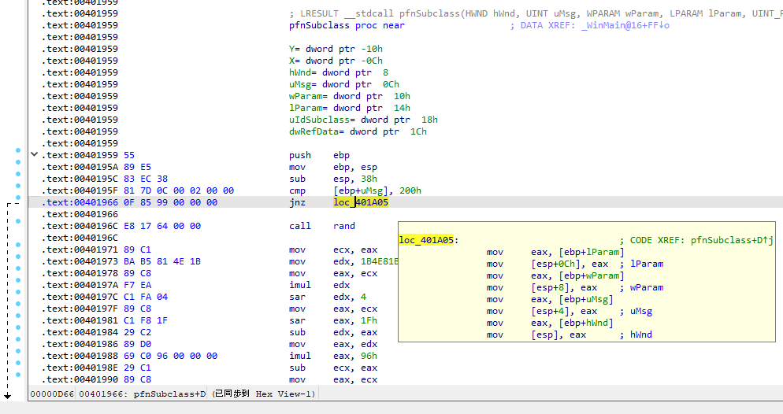
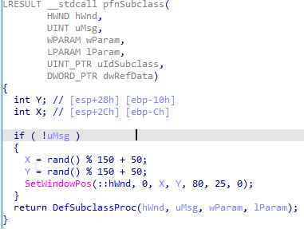
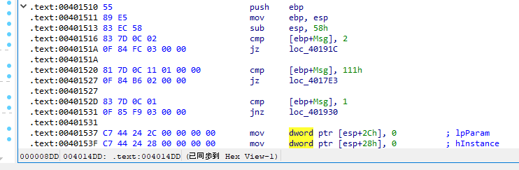
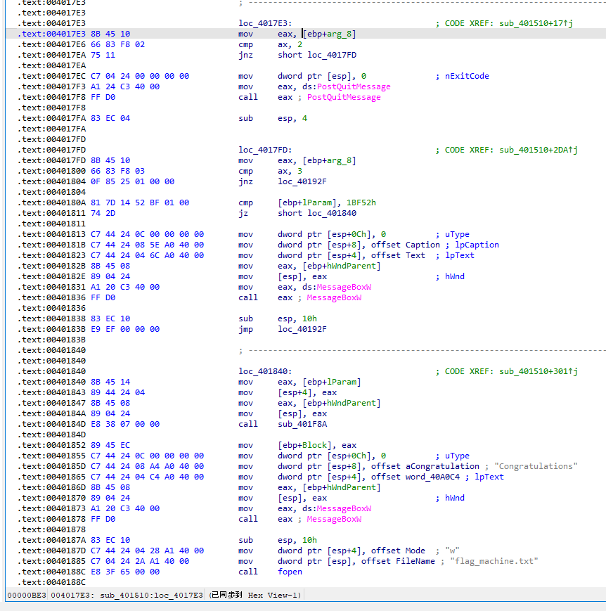
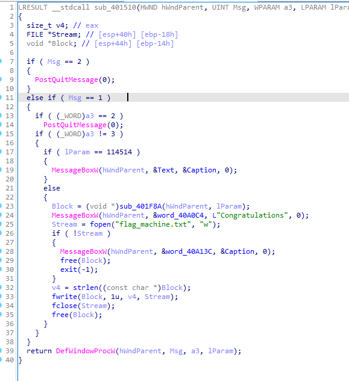

# 水银 2022 7-Day Trial

说了只做签到，然后心痒痒，就想着继续做吧。

然后发现我啥都不会，就是个跳梁小丑，真是丢人现眼。

部分吐槽见源码中注释掉的部分。


## 签到

先随便提交一次，然后会蹦出错误

注意 URL 变化，修改 `?result=????` 为 `?result=2022`

成功


## 举办猫咪问答喵谢谢喵

\*\*\*，真难找，我~~只找到三个~~ upd：六个答案已经都搞到了。

1. 搜了一下 Google 上的结果，第一次出现这个战队是在 https://cybersec.ustc.edu.cn/2019/0624/c15751a387753/page.htm , 但这并没有什么用。然后估计一下也不可能在 2012 年以前成立，那就和第六问一样，把答案枚举出来就行，反正最多才 96 种可能，连第六问都不如（

```diff
-days = [0,31,28,31,20,31,30,31,31,30,31,30,31] # to make datetime lib happy
-year = 2003
-while year < 2004:
+day = 1 # to make datetime.datetime() happy
+year = 2012
+while year < 2021:

-        day = 1
-        while day <= days[month]:

-                    'q1': "",
+                    'q1': date.strftime("%Y-%m"), # yyyy-mm

-                    'q6': date.strftime("%Y-%m-%d") # yyyy-mm-dd
+                    'q6': "" 

-            day = day + 1

```


2. 在 https://lug.ustc.edu.cn/wiki/lug/events/sfd/ 找到 陶柯宇 闪电演讲：《GNOME Wayland 使用体验：一个普通用户的视角》 slide 第 15 页，应该就是我们要找的程序。看起来似乎是一个影视后期处理软件，而且提到是 KDE 程序，那就前往 https://apps.kde.org/ 看看。好像有个叫 Kdenlive 的，一看长得一模一样，那就是了。


3. 直接翻译成英文搜，得到最后的大版本是 12.


4. 在 https://github.com/torvalds/linux.git 网页左上角的搜索框里输入 `CVE-2021-4034` , 选择 "in this repository" 即可得知唯一符合的 commit hash 为 `dcd46d897adb70d63e025f175a00a89797d31a43`


5. 提示说是 1996 年注册的域名，而且有且只有六个字母，就想到 [Z 佬](https://zenithal.me/)的 GPG uid 里有个 sdf.org 的号，结合当时和群友聊到这个站的历史和会员的难以获取，就瞎猜了一个 sdf.org 居然对了


6. 浅浅找了下妮可网络通的内容也只有 https://netfee.ustc.edu.cn/faq/index.html#fee , 然后在 wayback machine 上也没有找到 2012 年以前的记录。心一冷，直接谷歌搜 “网络通 ustc” 然后把时间调到 2009-01-01 和 2011-01-01 之间。好家伙，给我碰上了 https://www.ustc.edu.cn/info/1057/4931.htm . 其中提到的 “网字〔2003〕1号《关于实行新的网络费用分担办法的通知》” 没法在公网搜索引擎上找到了，似乎。

   想到大狐狸苏卡卡酱以前打 hg 的[绝招](https://blog.skk.moe/post/hackergame-2020-write-up/#:~:text=%E8%87%B3%E4%BA%8E%E5%9B%BE%E4%B9%A6%E9%A6%86%E5%89%8D%E7%9A%84%E5%9C%B0%E4%B8%8A%E5%81%9C%E8%BD%A6%E4%BD%8D%E3%80%81%E6%80%BB%E4%B8%8D%E5%8F%AF%E8%83%BD%E8%B6%85%E8%BF%87%20100%20%E4%B8%AA%E5%90%A7%EF%BC%9F)，我也来试试枚举吧，拿着做 [Xcaptcha](#我是机器人) 时候写的机器人改两笔就行了。从 2003-01-01 到 2003-12-31 总共才 365 个可能，这种数据规模还不到市面常见 CC 攻击的零头。

```python
# works on Python 3.10.8

import requests 
import re 
import time
import datetime

# set the URL
url = 'http://202.38.93.111:10002'  
# set a valid cookie
cookies = {
    'DOKU_PREFS': 'list%23thumbs',
    'session': 'SESSION_VALUE'
} 

# only try one targeted question, as is seen in form_data
regexp = re.compile("(你只答对了 1 题喵，不够喵！)") 

days = [0,31,28,31,20,31,30,31,31,30,31,30,31] # to make datetime lib happy
year = 2003
while year < 2004:
    month = 1
    while month < 13:
        day = 1
        while day <= days[month]:
            # establish a session
            time.sleep(1)
            with requests.session() as session: 
                date = datetime.datetime(year, month, day)
                # fill the form data
                form_data = {
                    'q1': "",
                    'q2': "",
                    'q3': "",
                    'q4': "",
                    'q5': "",
                    'q6': date.strftime("%Y-%m-%d") # yyyy-mm-dd
                } 
                # for debug purpose
                print(form_data)

                # send the data 
                response = session.post(url, data=form_data, cookies=cookies) 
                # Error handler
                if (response.status_code!=200):
                    print("HTTP ", response.status_code)
                    exit(1)
                # Here comes the flag
                match = re.findall(regexp, response.text)
                if len(match):
                    print(match)
                    exit(0) # exit on success
            day = day + 1
        month = month + 1
    year = year + 1

```


## 偷家

解压，得到 `user` 家目录。然后用 vscode 打开文件夹，直接搜索 "flag". 

<!--其实是找了大半天才找到 rclone 那个，然后才想到用 vscode（-->

<!--真是找死我了（吐血-->


### Vscode

搜索结果中有一个 "DUGV.c", 注释第五行可以看到 flag. 


### Rclone

在 `user/.config/rclone/rclone.conf` 出现 "flag2", 其中有被 obscure 过的 pass.

搜谷歌的时候发现了提到这个 [playground](https://go.dev/play/p/IcRYDip3PnE) 的[帖子](https://forum.rclone.org/t/how-to-retrieve-a-crypt-password-from-a-config-file/20051)，改掉 `YOUR PSEUDO-ENCRYPTED PASSWORD HERE` 就能得到结果。

考虑到原链接随时可能失效，拷贝程序源码如下：

```go
package main

import (
	"crypto/aes"
	"crypto/cipher"
	"crypto/rand"
	"encoding/base64"
	"errors"
	"fmt"
	"log"
)

// crypt internals
var (
	cryptKey = []byte{
		0x9c, 0x93, 0x5b, 0x48, 0x73, 0x0a, 0x55, 0x4d,
		0x6b, 0xfd, 0x7c, 0x63, 0xc8, 0x86, 0xa9, 0x2b,
		0xd3, 0x90, 0x19, 0x8e, 0xb8, 0x12, 0x8a, 0xfb,
		0xf4, 0xde, 0x16, 0x2b, 0x8b, 0x95, 0xf6, 0x38,
	}
	cryptBlock cipher.Block
	cryptRand  = rand.Reader
)

// crypt transforms in to out using iv under AES-CTR.
//
// in and out may be the same buffer.
//
// Note encryption and decryption are the same operation
func crypt(out, in, iv []byte) error {
	if cryptBlock == nil {
		var err error
		cryptBlock, err = aes.NewCipher(cryptKey)
		if err != nil {
			return err
		}
	}
	stream := cipher.NewCTR(cryptBlock, iv)
	stream.XORKeyStream(out, in)
	return nil
}

// Reveal an obscured value
func Reveal(x string) (string, error) {
	ciphertext, err := base64.RawURLEncoding.DecodeString(x)
	if err != nil {
		return "", fmt.Errorf("base64 decode failed when revealing password - is it obscured? %w", err)
	}
	if len(ciphertext) < aes.BlockSize {
		return "", errors.New("input too short when revealing password - is it obscured?")
	}
	buf := ciphertext[aes.BlockSize:]
	iv := ciphertext[:aes.BlockSize]
	if err := crypt(buf, buf, iv); err != nil {
		return "", fmt.Errorf("decrypt failed when revealing password - is it obscured? %w", err)
	}
	return string(buf), nil
}

// MustReveal reveals an obscured value, exiting with a fatal error if it failed
func MustReveal(x string) string {
	out, err := Reveal(x)
	if err != nil {
		log.Fatalf("Reveal failed: %v", err)
	}
	return out
}

func main() {
	fmt.Println(MustReveal("YOUR PSEUDO-ENCRYPTED PASSWORD HERE"))
}

```


## 真甜

<!--发现自己不会用正则表达式去替换，笑死，那就-->

直接替换 `|` 为 `]=a[`

难看，但这 py 语法葡萄糖真甜，除杂都省了，直接饮用。


## 我是机器人

上来就跳转是怎么回事？草

手速拉满，然后开了 noscript 终于不跳了，总算看到了里面有个一秒就提交的 `<script>`, 还有一个 `<form>` 用来放三个计算题。但还是没啥用，1 秒的限制在后端也有。

<!--用 curl ~~浏览器~~被拦住了，忘了还有 cookie. 也不想折腾 shell script 了，-->

那就干脆 py request 模拟，这样够 bot 了吧（

<!--（咱安装 request 都被 pip 毒打，还是早点紫菜吧）-->

<!--继续开 noscript, 开 F12 去 network 里拿个 cookie 格式，然后随便提交一个答案，看一下 form data 格式。-->

然后我一个根本不会写代码的，开始搭建 python 危房。

<!--~~这里窝借用一下[某位 PGP 算号神人的骚话](https://www.douban.com/note/763978955)：~~ -->

<!--~~ > JavaScript 就这个好，给点星星之火就可以燎原。不光野，还浪，容易上手，以至于不管是谁都能上去霍霍两下 ~~ -->

<!--~~对于 py 大概也是如此（（~~ -->

<!--尝试 py 的时候才发现原来用无头浏览器（比如 py requests / curl）就不怕 script 了。flag 里也这么说（（-->

三个计算题包装在 `<label>` 中，格式如下：

```html
<label for="captcha2">258033923847200268802989441771128447507+193408310580629933415510529078909027659 的结果是？</label>
```

掏出[正则模拟器](https://regex101.com)随便糊个表达式，用 Match Group 把那俩数字拎出来。

```regex
\<label for\=\"captcha(\d)\"\>(\d+)\+(\d+)(.*)\<\/label\>
```

然后转换格式、计算、送走（

访问题目时需要使用 cookie, 也即填写此处 `session` 的值。用浏览器开一下题目，F12 就能拿到，顺便随手交一次看下 form 格式。

完整代码如下：

```python
# works on Python 3.10.8

import requests 
import re 

# set the URL
url = 'http://202.38.93.111:10047/xcaptcha'  
# set a valid cookie
cookies = {
    'DOKU_PREFS': 'list%23thumbs',
    'session': 'SESSION_VALUE'
} 

# establish a session
with requests.session() as session: 
    # get the challenge captcha
    r_text = session.get(url, cookies=cookies).text 
    # for debug purpose
    print(r_text,"\n\n\n") 

    # regular expression to match the HTML element. Group 2 and 3 are the target numbers. 
    regexp = re.compile("\<label for\=\"captcha(\d)\"\>(\d+)\+(\d+)(.*)\<\/label\>") 
    # find all matches (actually 3)
    match = re.findall(regexp, r_text) 
    # print(match, "\n")

    # define a list to store answers
    ans = {}
    for i in range(0,3):
        # (forcibly) convert data type and calculate the answer. 
        ans[i] = int(match[i][1]) + int(match[i][2]) 
        # print(int(match[i][0]), " ", ans[i], "\n")

    # fill the form data
    form_data = {
        'captcha1': ans[0],
        'captcha2': ans[1],
        'captcha3': ans[2]
    } 
    # for debug purpose
    print(form_data, "\n\n\n")

    # send the data to prove "I'm a robot"
    response = session.post(url, data=form_data) 
    # Here comes the flag
    print(response.text) 

```

搞定，成功证明自己是 bot. 

~~果然 bot 的活还是得交给 bot, 想到最近的 AI 画画，心情复杂（（~~


## woc 恶俗啊

### 照片分析

用 gwenview 或者 `jhead -v` 得到 exif 信息

```
Exif Version:       2.31
Manufacturer:       Xiaomi
ISO Speed Ratings:  84
Date and Time:      2022/05/14 18:23:35
Flash:              No, compulsory
```


### 社工实践

放大照片，可看见前方的圆形建筑有字 ZOZOMARINE STADIUM 和 CHIBA LOTTE MARINE. 搜索后可知与“千葉海洋球場”有关。从拍摄角度能推测拍摄者所在建筑相对于球场的方向，顺带对比图中的道路，估计其位于  APA度假飯店東京灣幕張  ，邮政编号 261-0021.

已知该机器是小米的，搜索 gsmarena 对比各代机型<!--（对不起我真的认不得那么多的机器）-->猜测为 Redmi 9T, 屏幕分辨率 2340x1080.

航班的话，观察照片中飞机的姿态，结合拍摄者所在位置和拍摄角度，判断这架飞机大致是朝北方飞行。尚能目视，那么高度不算太高。且附近也没有其他飞机。

想回溯那么久以前的航班只能靠 flightradar24 了。先骗个 7-day gold trial, 然后回溯一下照片拍摄时的空域情况。注意，exif 中还有时区信息 +0900, 之前的时间是当地时间，需要换算成 UTC. 调至 2022-05-14 09:23:35 UTC 不难得知航班为 NH683 (HND -> HIJ)

~~拿到 flag, 别忘了把 gold subscription 取消掉~~


## 胶衣 PLAY

### 纯文本

咕咕搜索 "Latex include other file in the file system"

然后在[这里](https://tex.stackexchange.com/questions/246/when-should-i-use-input-vs-include)看到了大佬们的指点。于是：

```latex
\input{/flag1}
```

然后输出了第一个 flag. 记得补上花括号。


### 特殊字符混入

混进去的两个都是 escape char, 一时有点头大。

搜了 regex, 没有；搜到 verbatim, 不行。

脚本里面有 `-no-shell-escape` 没法干坏事。真麻了。

在搜 escape char 的时候，[摸到](https://tex.stackexchange.com/questions/543565/setting-the-backslashs-catcode) `\catcode` 这个东西。心灰意冷之下试了试居然能用。

又在学习胶衣基本语法的时候看到了 [\\\\ 的用法](https://www.overleaf.com/learn/latex/Learn_LaTeX_in_30_minutes#Paragraphs_and_new_lines)。拿出来试了下还真能用，那就可以在 form data 里面塞入多行内容了。

那就好办了。

把 `#` 和 `_` 的 catcode 改成 12 就行了。

```latex
\catcode`\_=12 \\ \catcode`\#=12 \\ \input{/flag2} 
```

补上花括号，搞定。


## 垃圾运维

<!--~~revisions 关了却能看 diff 是怎么回事~~-->

又没什么登录的线索，只好简单学习了一下 dokuwiki 的官方 wiki, 发现除了 revision 还有 [diff](https://www.dokuwiki.org/diff) 这个好东西。

<!--（什么垃圾运维，换我直接把源站下线）-->

在 URL 末尾追加 `&do=diff` 即可打开 diff 页面，然后就能查看修改历史了。


## 工程1.psd

大概是个 gerber file. 

用 gerbv 导入所有设计图，逐个查看后发现 `ebaz_sdr-F_Cu` 好像有类似 flag 的玩意印在上面，后面被一些东西挡住了。鼠标选中直接删掉就能看到 flag. 


## 黑色高级自动机

随便 HexDump 一下就能看见好多 flag, 可那有什么用呢，又不是真的 flag, 旁边还有神户小鸟（Kanbe_Kotori）呢（（

不过有个提示，好像说不需要直接啃 flag, 看来还得骗出来才行？

<!--没用过 IDA 是真的痛苦，只好费劲下个破解的 Pro 版，破解版又信不过，还要配个虚拟机。-->

<!--顺便后悔一下没有好好学汇编，一开始对着满屏幕的汇编，真的会晕过去的。-->

<!--不过好在搜到了，按一下 F5 就基本能把晦涩的汇编变成 C 的代码了。-->

<!--后来才意识到依旧没有啥用，还是要对着汇编去改。-->

首先尝试运行，“残忍夺取”的按钮居然会躲着鼠标走，实在是很有上古时代恶搞程序的感觉了。

<!--经过一番艰苦的搜索，在某个角落里找到了这一极具特色的玩意（-->

打开 IDA 按一下 F5, 主程序的入口应该在 `_WinMain@16_` 处，在里面翻了一圈以后发现 `pfnSubclass` 里面的东西有点像是按钮乱飞的罪魁祸首。

```C
LRESULT __stdcall pfnSubclass(
        HWND hWnd,
        UINT uMsg,
        WPARAM wParam,
        LPARAM lParam,
        UINT_PTR uIdSubclass,
        DWORD_PTR dwRefData)
{
  int Y; // [esp+28h] [ebp-10h]
  int X; // [esp+2Ch] [ebp-Ch]

  if ( uMsg == 512 )
  {
    X = rand() % 150 + 50;
    Y = rand() % 150 + 50;
    SetWindowPos(::hWnd, 0, X, Y, 80, 25, 0);
  }
  return DefSubclassProc(hWnd, uMsg, wParam, lParam);
}
```

直接看汇编的话，长这样：



触发这玩意的条件是 `uMsg == 512` . 搜了一下，似乎是一种叫做 [windows message](https://learn.microsoft.com/en-us/windows/win32/winmsg/about-messages-and-message-queues#windows-messages) 的玩意，在 winehq 上有比较完整的[取值列表](https://wiki.winehq.org/List_Of_Windows_Messages)。查表，看起来真的是鼠标移动触发，那就删掉吧。

咋办呢？看了下汇编代码，把成立条件改成 `uMsg==0` 就好了。

`(.text.00401963) 00000D63: 02 -> 00`

改完以后



IDA patch 改起来太慢，干脆用 HxD 改完开跑，按钮确实不飞了。

接下来就是骗 flag 了。把 flag 骗出来主要靠 `sub_401510` 函数。想要到达输出 flag 的程序段需要经过三次 if. 第一次是根据 `Msg` 也即上文的 `uMsg`, 第二次是 `a3`, 第三次是 `lParam`. 

要素给的很到位捏，意义是无意识：

```C
LRESULT __stdcall sub_401510(HWND hWndParent, UINT Msg, WPARAM a3, LPARAM lParam)
{
  size_t v4; // eax
  FILE *Stream; // [esp+40h] [ebp-18h]
  void *Block; // [esp+44h] [ebp-14h]
  HFONT wParam; // [esp+48h] [ebp-10h]
  unsigned int dwNewLong; // [esp+4Ch] [ebp-Ch]

  switch ( Msg )
  {
    case 2u:
      PostQuitMessage(0);
      break;
    case 0x111u:
      if ( (_WORD)a3 == 2 )
        PostQuitMessage(0);
      if ( (_WORD)a3 == 3 )
      {
        if ( lParam == 114514 )
        {
          Block = (void *)sub_401F8A(hWndParent, 114514);
          MessageBoxW(hWndParent, &word_40A0C4, L"Congratulations", 0);
          Stream = fopen("flag_machine.txt", "w");
          if ( !Stream )
          {
            MessageBoxW(hWndParent, &word_40A13C, &Caption, 0);
            free(Block);
            exit(-1);
          }
          v4 = strlen((const char *)Block);
          fwrite(Block, 1u, v4, Stream);
          fclose(Stream);
          free(Block);
        }
        else
        {
          MessageBoxW(hWndParent, &Text, &Caption, 0);
        }
      }
      break;
    case 1u:
      hWnd = CreateWindowExW(0, &ClassName, &WindowName, 0x50000000u, 85, 150, 80, 25, hWndParent, (HMENU)3, 0, 0);
      dword_40B024 = CreateWindowExW(
                       0,
                       &ClassName,
                       &word_40A040,
                       0x50000000u,
                       185,
                       150,
                       80,
                       25,
                       hWndParent,
                       (HMENU)2,
                       0,
                       0);
      dword_40B028 = CreateWindowExW(
                       0,
                       &word_40A04A,
                       lpWindowName,
                       0x50000000u,
                       85,
                       100,
                       300,
                       20,
                       hWndParent,
                       (HMENU)1,
                       0,
                       0);
      dwNewLong = GetWindowLongA(hWndParent, -16) & 0xFFFEFFFF;
      SetWindowLongA(hWndParent, -16, dwNewLong);
      wParam = CreateFontW(12, 0, 0, 0, 400, 0, 0, 0, 0x86u, 0, 0, 2u, 0x12u, &pszFaceName);
      SendMessageA(hWndParent, 0x30u, (WPARAM)wParam, 1);
      SendMessageA(hWnd, 0x30u, (WPARAM)wParam, 1);
      SendMessageA(dword_40B024, 0x30u, (WPARAM)wParam, 1);
      SendMessageA(dword_40B028, 0x30u, (WPARAM)wParam, 1);
      break;
  }
  return DefWindowProcW(hWndParent, Msg, a3, lParam);
}
```

汇编长这样：





再次按下按钮准备残忍夺取 flag, 怎料突然弹出窗口，说我不是“超级管理员”。窗口大小很接近 300x100, 看来 `sub_401510` 函数里面的 `Msg` 是 1 了，那就直接把第二处比较的数字从 111h 改成 1 就行，反正最后一个 case 分支没有跳转入口。

`(.text.00401523) 00000923: 11 -> 01`

`(.text.00401524) 00000924: 01 -> 00`

再次尝试进去的时候窗口空白，从逻辑关系图看，大概是进了 `nop` 了，至少 `a3` 不等于 2. 那就试着改下跳转条件吧，改成 `a3==3` 才跳走（`jz`），这样就能继续执行对 `lParam` 的判断，以及到 `loc_401840` 的跳转了：那是 flag 的所在。

`(.text.00401800) 00000C05: 85 -> 84` 

~~看起来没啥问题，大不了回头再改。~~

至于 `lParam` 显然不可能是那么臭的数字，直接改成 `lParam!=114514` 跳走（`jnz short`）。

`(.text.00401811) 00000C11: 74 -> 75` 

改出来效果大概就是这样：



然后成功了，与预期一致的祝贺消息框以及输出的 flag_machine.txt. 打开一看，应该不会是假 flag. 骗到了。

当时没有在强行逆向解码函数的路上走太远...准确说，看见里面的某个不确定数组以后就放弃了，没想到真的单独拿出来跑。


## XSS 好难，想死死

从 bot 的代码来看，flag 就在 cookie 里面。只要拿到 cookie 就行了。

先是想往 return 的结果里面下毒，显然没成。

然后一直没思路，倒数第二天晚上终于想到，既然是想执行代码，那就考虑 XSS, 可是自己也不会 XSS 啊，对 js 也是一窍不通；不过看了一下里面的代码，搜了一下，判断出分享链接里的 result 只是把 `score:name` 编码成 base64 得到，再次打开时则会解码，用冒号切开得分和名字，然后用 `document.querySelector().innerHTML` 去替换对应元素里面的内容。

那就可以直接构造了，把想要植入到 HTML 里面的内容按照格式写好编码就行。数字在前，那就尽可能只改 name. 

一开始是想直接放个 script 去改变量、改网页，然后但是发现换进去的 inline script 根本没被执行，后来才知道 script 的执行也有顺序。

另外发现如果 base64 字串里面出现 `+` 就会让服务器 500. script 直接丢进 query string 好像也会 500. 

然后想往里面塞 img, 把 cookie 放在 URL query string 里面偷走，然后用自己的服务器去收，结果发现死在同样的问题上，如果要把变量塞进 src link 里面就要用 script,  但是用 script 就要面对执行顺序的问题。

心灰意冷之下搜了 "innerhtml inject javascript", 找到了 StackOverFlow 帖子 `Executing <script> elements inserted with .innerHTML` 里面的一个[回答](https://stackoverflow.com/a/3714367)。简单说就是用一个 img 元素在 onload 的时候执行 js 代码。这样就会等到后面的 script 把元素替换好以后才开始执行代码。

那就很简单了，直接把<!--从-->整个 greeting <!--和 score 里面挑一个-->换成 cookie 就行了。

还是半天都不行，然后 F12 发现 `document.querySelector("#greeting")` 的第一个双引号后面居然被加了空格...从高亮来看似乎是和 onload 的双引号冲突了... escape char 也无效。

真麻了，凭着自己以前折腾博客的经验，大概试了一下用单引号去换：

```html
0:
```

base64 以后，补全 path

```
/share？result=MDo8aW1nIHNyYz0iZGF0YTppbWFnZS9naWY7YmFzZTY0LFIwbEdPRGxoQVFBQkFJQUFBQUFBQVAvLy95SDVCQUVBQUFBQUxBQUFBQUFCQUFFQUFBSUJSQUE3IiBvbmxvYWQ9J2RvY3VtZW50LnF1ZXJ5U2VsZWN0b3IoIiNncmVldGluZyIpLmlubmVySFRNTD1kb2N1bWVudC5jb29raWU7Jz4=
```

成了。

然后丢进 web shell, 得到的 greeting 就变成 cookie 的内容，也就是 flag 了。

好难，想死。


## 这酒有毒

### flag1

手生了不会写 C 了，那就直接搜一下 C 语言怎么读文件吧（

https://www.geeksforgeeks.org/c-program-to-read-contents-of-whole-file/

直接跑，然后 server 会绝赞报错。

```
UnicodeDecodeError: 'utf-8' codec can't decode byte 0xff in position 90: invalid start byte
```

然后发现 do-while 会把 EOF 也输出到 stdout, 那避免掉就行。

```C
// C program to implement
// the above approach
#include <stdio.h>
#include <stdlib.h>
#include <string.h>
 
// Driver code
int main()
{
    FILE* ptr;
    char ch;
 
    // Opening file in reading mode
    ptr = fopen("/flag1", "r");
 
    if (NULL == ptr) {
        printf("file can't be opened \n");
    }
 
    printf("content of this file are \n");
 
    // Printing what is written in file
    // character by character using loop.
    ch = fgetc(ptr);
    while (ch != EOF) {
        printf("%c", ch);
        ch = fgetc(ptr);
        // Checking if character is not EOF.
        // If it is EOF stop eading.
    } 
 
    // Closing the file
    fclose(ptr);
    return 0;
}

```

没想到这 150 分就和白给一样。~~然后 flag2 就卡住了~~


## 浇窝 WebGL 好不好嘛

折腾了半天也不是很懂。<!--还把我的电脑跑崩了好几次，这就是现代科技吗（-->

网页结构很简单，很适合在本地跑，我也确实是这样做的。咱猜是要修改那四个 js. 

WebGL 确实也看不大懂，搜了下里面的函数名字，大概是用光线追踪写的玩具。

但里面最让我感到奇怪的就是五个 SDF. 前四个那么大那么沉，而最后那个又那么短，结合图像中固定的 flag 字样，还有那个模糊的后半段，很难不联想到前四个 SDF 就是把字母画出来，最后那个负责画一个矩形挡住 flag. 

看了下只有 `sceneSDF` 中调用过这五个函数。

直接把其中的 t5 被赋值/调用的地方改成随便一个浮点数（比如 1e1 之类的常量，或者其他 float 变量）就行了。

重新渲染，就能看到 flag 了。


## 数数

### 这么简单我闭眼都可以

枚举，从 0000 开始试，试到 1000 碰上了，成功。


## 写在最后

最近发生的事情对我打击还是挺大的，一直摆烂得很，也不知道发了什么疯来碰 hg. 

这应该是咱这辈子第一次打 CTF, 没有想到自己真的能拿到除了签到以外的那么多分数。

只不过大部分都是 misc 和 web 的雕虫小技，没啥科技含量，窝基本是靠着 Google 一路走过来的，而且 Google 用得也很差（参见我的猫咪问答题解）；binary 和 math 也没怎么碰。虽然也学到了不少细碎的知识，却感觉还是没啥提升。看完官方题解才意识到我的认知还是太狭隘了，真得从头恶补才行。

遗憾的是自己还是太麻木，把猜数字、OJ、轮盘赌和杯窗鹅影这几题给放掉了，本来是很好的一个学习 C 和 Linux 的机会。好在平台还会继续运行三个月，还可以慢慢折腾那些好玩的题目。

---

也更强烈地意识到几件事情：

- 有什么想法就要大胆地记录或者投入实践。
- 自己的思维高度还是不及大佬们，应当继续学习。
- 基础不牢地动山摇，该恶补了。

---

但是为了解题而紧张的感觉已经很久没有过了。打下一题就写一题的 wp 也很有成就感。

中午 12 点 wp 解禁的时候，竟有种如释重负的感觉。

打 hg 的时候就仿佛在吸电子鸦片。

> 和群友们讨论时，简直是在 ToS 边缘疯狂试探，还能因为各种趣事而狂笑不止。

> 课都不上了 就想着打 hg 了

> 感觉 hg2022 大概是咱未来这段时间里最充实的时刻了

---

最后，感谢在幕后为这次 hackergame 作出贡献的 staff 们，把这么棒的比赛呈现给了我们。

明年也会继续来玩的！

